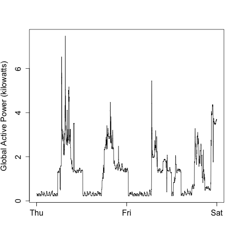
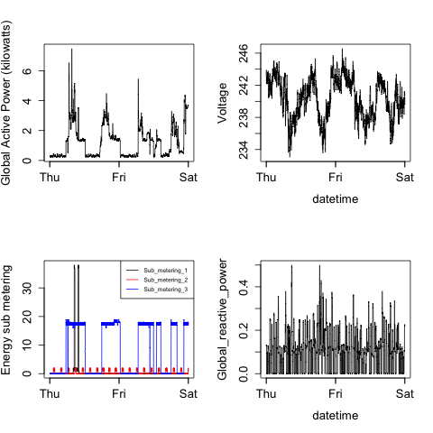

Greetings! I've uploaded my completed code & image files in this Repo. They are shown below. Note a minor discrepancy in in fourth graph of the fourth Plot - the y axis values are shown differently than the example given. I'm not sure why, but the graphs are the same.

### Plot 1

 

### Plot 2

 

### Plot 3

 

### Plot 4

 

